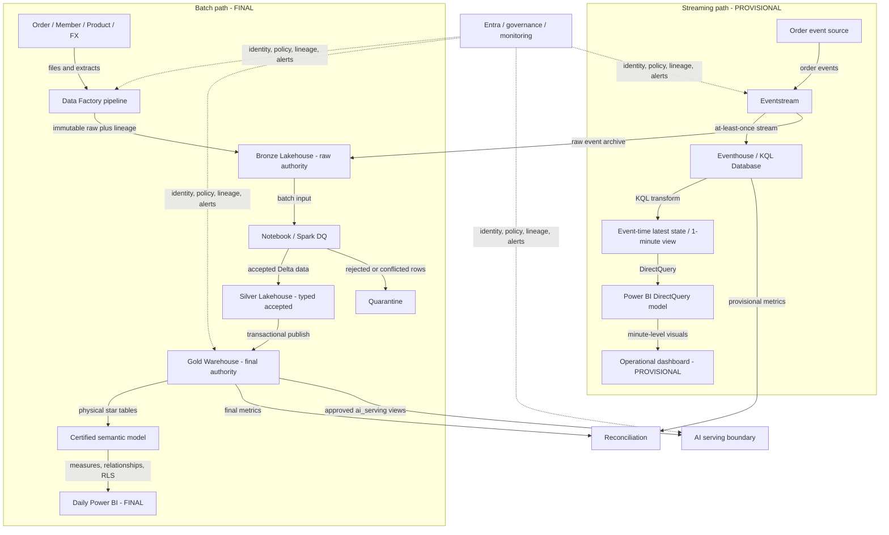
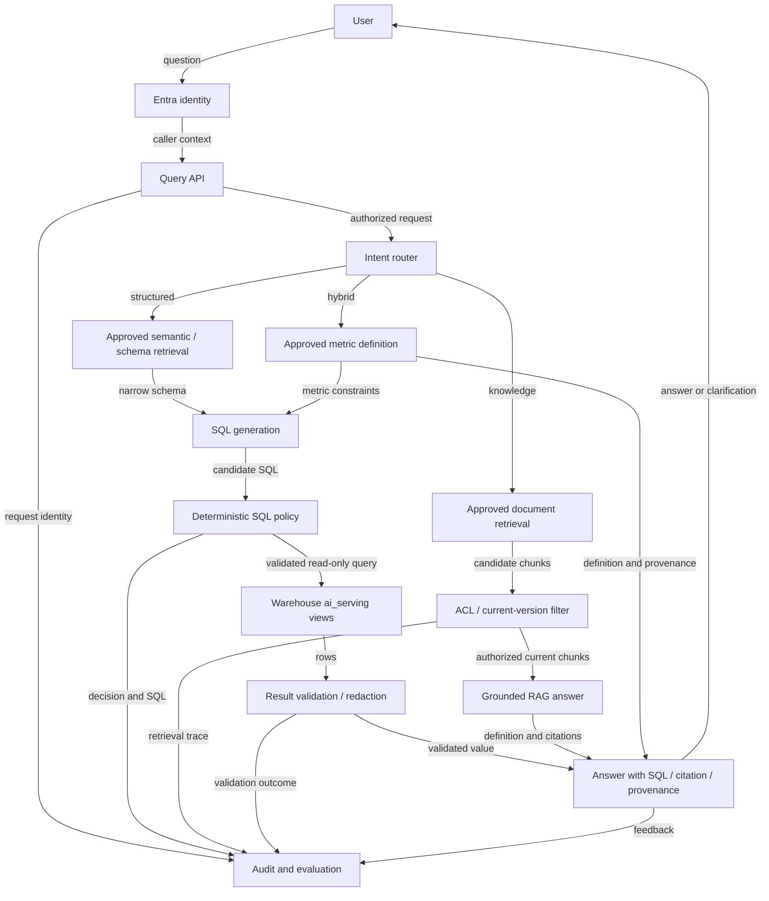

# Part C — Microsoft Fabric 架構設計

文件狀態：`implementation_complete_acceptance_pending`。以下是 proposed architecture，並非
Fabric deployment evidence；`Fact` 是官方文件可支持的產品行為，`Inference` 是本題設計判斷，
`Assumption` 是上線前須確認的前提，`Tenant validation required` 是必須在目標環境 POC 的項目。

## Executive summary

本設計以 OneLake 為共同儲存基礎：Bronze／Silver Lakehouse 分別保存可 replay 的原始資料與
通過型別、品質及去重規則的資料；Gold Fabric Warehouse 以星型模型提供 `FINAL` 分析結果。
每日 Power BI 只讀 Gold physical tables 的 certified semantic model。訂單事件則經 Eventstream
進入 Eventhouse／KQL Database，依 event time 建立一分鐘 `PROVISIONAL` latest-state aggregate，
由 Power BI DirectQuery operational model 顯示。每日批次重算最終狀態並與 hot path reconcile。

AI 問數預設只查 Warehouse `ai_serving` approved views。Structured、knowledge 與 hybrid 問題
分別走 Text-to-SQL、permission-aware RAG、或「先取定義、再產 SQL」；所有 SQL 必須通過
deterministic policy validation，答案附 freshness、quality、SQL／來源與 audit。這同時滿足每日
BI、分鐘級儀表板及可信自然語言問數，而不把 Raw、PII 或高權限 credential 暴露給 LLM。

## Assumptions 與非目標

| 類型 | 前提／限制 | 設計依賴與改變時的調整 |
|---|---|---|
| Assumption | 來源提供 durable event、stable `event_id`、`order_id`、`updated_at`、source sequence／version、emitted time、schema version、payload hash | 否則不能可靠去重與排序；stable ID 是上線前 contract，payload hash 只能偵測內容，不冒充權威 ID。 |
| Assumption | Fabric capacity、region、event volume、concurrency、RPO／RTO、retention、cost budget 均未知 | 不捏造 SLA 或 sizing；量測後調整 capacity、partition、retention 與批次窗口。分鐘級 freshness 不變。 |
| Tenant validation required | Direct Lake on OneLake 的 Warehouse、capacity、region、OneLake security 與模型功能適配尚未 POC | 不符合則採 Import；Direct Lake on SQL 只作替代評估。 |
| Tenant validation required | Entra delegated／OBO 到 Warehouse 的 token audience、connector、authorization、RLS／OLS propagation 未驗證 | 不支援時改由 query service 先做 caller entitlement，再以 least-privilege service principal 查 approved views；不得使用共用高權限帳號。 |
| Assumption | Azure AI Search 是 Fabric 外部的相鄰 Azure 服務，公司是否允許尚未知 | 若要求 Fabric-only，重新評估 tenant 當時的 Fabric-native retrieval 能力，不假設兩者等價。 |
| 非目標 | 本文件不建立 tenant、capacity、pipeline、Lakehouse、Warehouse、semantic model、AI service 或效能證據 | 實作前仍需 security review、capacity／cost estimate、POC 與正式 runbook。 |

## Fabric data platform architecture diagram

實線是 data plane 的資料或查詢流；虛線是 control plane。題目指定三種 consumer 與分鐘級要求；
其餘元件、authority、路由及 `PROVISIONAL`／`FINAL` 分界均為本題 proposed design。

## 三條 workload path

| Path | Source → ingestion → storage → transformation → serving → consumer | Freshness／failure handling | Ownership／monitoring |
|---|---|---|---|
| Daily BI | Order／Member／Product／FX → Data Factory → Bronze → Notebook DQ → Silver → Gold Warehouse → certified semantic model → Power BI | 每日；activity retry 只重做 idempotent step，DQ 或 reconciliation 失敗不得 publish Gold；source registry 支援相同檔案 deterministic rerun。 | Data Platform owner 管 pipeline／Lakehouse／Warehouse；Analytics owner 管 model。監看 run status、row／money／checksum、quarantine、freshness。 |
| Minute dashboard | Durable order events → Eventstream → Eventhouse → event-time latest state／1-minute aggregate → DirectQuery model → Power BI | 分鐘級目標；at-least-once 所以 sink 去重。以 watermark 收 late event，保留 raw archive、checkpoint／high-water mark 及 replay；壞 schema／conflict 隔離。 | Streaming owner 管 event contract、KQL 與 replay；BI owner 管 operational model。監看 lag、backlog、watermark、duplicate、late、error rate。 |
| Trusted AI | User → Entra → Query API／router → narrowed metadata 或 approved RAG → SQL policy／ACL → read-only execution／retrieval → validation／citation → answer | 預設 Gold `FINAL` 的 `data_as_of`；明確 live 問題才讀 hot path並警示。timeout、有限 repair、refuse／clarify，失敗不繞過 policy。 | Data／metric owner 維護 contract，Security owner 管 entitlement，AI owner 管 router／eval。監看 audit、reject、permission failure、groundedness、citation coverage。 |

### 每日批次 BI 細節

Data Factory 負責 schedule、參數、依賴、retry 與 publish gate。Bronze 保存 raw bytes／rows、logical
filename、source hash、batch sequence、source row、ingested time 與 lineage，並以 source registry 防止
同一 identity 重複套用。Notebook／Spark 產生 typed Silver，套用 Part A 已驗證語意：schema gate、
deterministic latest-state、duplicate／same-time conflict、dated FX、Decimal 與 rounding、missing
dimension、quarantine、row／money reconciliation。這是把既有語意移植至 Fabric 的設計，不代表已執行。

Silver validation 通過後，Warehouse 在明確 T-SQL transaction 中先 expire 再 insert SCD2
`dim_member`（`valid_from` inclusive、`valid_to` exclusive），維護 `dim_product`、`dim_date`，再依
order business time 做 as-of key lookup／upsert `fact_order`。任一 invariant、referential、money 或
reconciliation gate 失敗即 rollback，不發布部分 Gold。Gold model 定義 metric、relationships、
role-playing dates、currency、freshness、RLS／OLS，報表顯示 `FINAL` 與 `data_as_of`。

Power BI 新模型優先 **評估** Direct Lake on OneLake，直接使用 Gold physical star tables，metric 與
使用者 RLS 優先在 semantic model；最終仍須 tenant／capacity POC。Direct Lake on OneLake 不使用
DirectQuery fallback。SQL views 或 SQL endpoint RLS 引發 fallback 是 Direct Lake on SQL 的行為，
且可能改變效能；AI `ai_serving` views 因此不是 BI Direct Lake table source。若 capacity、region、
security 或功能不合，採 Import，接受額外複製與 refresh latency，不能預設哪個一定較快或較便宜。

### 分鐘級事件細節

Eventstream 的 delivery 以 at-least-once 設計，不宣稱 exactly-once。Eventhouse 先以 stable
`event_id` 去重，再以 `updated_at`（business timestamp）加 source sequence／version 決定每張訂單
latest state；同一 timestamp／sequence 但 payload 不同者進 conflict quarantine，不任意選 winner。
event time 決定業務窗口，processing time 僅量測 lag；watermark 內的 late／out-of-order event 觸發
受影響分鐘重算，超出邊界者保留、告警並等 batch final 或發布 correction。

Eventstream／source checkpoint 或 high-water mark 與 ingest audit 一起保存；replay 從 durable source
或 Bronze immutable archive 依 offset／time range 重送，仍由 event ID 去重。Source retention 必須
覆蓋最大可接受 recovery window，實際值待 RPO／RTO 決定。Power BI DirectQuery operational model
只顯示 `PROVISIONAL`、event-time `as_of` 與 late-data warning。

## 元件與分層職責

| 元件／boundary | 輸入、輸出與存在理由 | Owner／failure、observability 與 security boundary |
|---|---|---|
| Data Factory | 四類批次來源 → 參數化 run／Bronze；協調依賴和 Gold publish gate。 | Platform；failed activity／partial copy 以 run ID retry；監看狀態、duration、bytes；managed identity 只寫指定 item。 |
| Bronze Lakehouse | 不可變 raw、event archive、identity／lineage；raw／replay authority。 | Data Engineering；缺檔／hash drift hard fail；監看 arrival、hash、retention；限制工程角色，AI／BI不得讀。 |
| Notebook＋Silver | raw → typed accepted／normalized、DQ metrics、quarantine；支援 Spark transformation。 | Data Engineering；schema／DQ gate fail；監看 row、money、checksum；敏感欄位維持分類與受限 workspace。 |
| Gold Warehouse | Silver → transactionally consistent SCD2／star；`FINAL` analytical authority及 SQL serving。 | Warehouse owner；transaction rollback／publish block；監看 RI、SCD overlap、fact grain、freshness；按 item／object 最小權限。 |
| Semantic models | Gold physical tables 或 KQL aggregate → business measures、relationships、security、freshness。 | Analytics／metric owner；model refresh／query failure；監看 model、fallback／refresh；consumer 是 Viewer，RLS 不以高權限 workspace role替代。 |
| Eventstream＋Eventhouse | event → durable hot store、latest state及分鐘 aggregate；承接低延遲查詢。 | Streaming；duplicate、lag、bad schema、retention gap；監看 backlog／watermark／errors；producer／consumer 分離授權。 |
| AI boundary＋knowledge index | approved schema／views與 approved documents →受政策約束的 SQL／citation。 | AI＋Security；拒絕 unsafe／unauthorized／low confidence；全程 audit；LLM 無 Warehouse credential、無 Raw／PII access。 |

## Batch／stream reconciliation

Eventhouse state 是 provisional；event time 用於業務 metric，processing time 只用於 lag 量測。每日
pipeline 從 Bronze 重新套用完整 Part A 規則，Gold 是 final。
同一 business-date 至少比較 order count、latest status、gross、net、duplicate、late、quarantine 與日期
aggregate。差異分類為 late、duplicate、conflict、schema、FX、quality、missing event，保存兩側
`as_of`、run ID 與 drill-down keys。超出 tolerance（數值由 owner 核准）即阻擋 final publish 或告警；
必要時發布 correction event／rebuild affected aggregate，永不覆寫 raw。Daily BI 只呈現 final，hot
dashboard 明示 provisional，AI 預設 final；所以同名 metric 的定義相同，差異可由時間與品質狀態解釋。

## 關鍵 trade-off

| 欄位 | Trade-off 1：Lakehouse vs Warehouse | Trade-off 2：Eventstream vs micro-batch |
|---|---|---|
| Decision question | Spark／raw 彈性與 SQL／BI transaction 如何兼得？ | 分鐘 freshness 是否值得常駐 streaming 複雜度？ |
| 選項 A | 全 Lakehouse：少一種 item、Spark 直接處理 Delta，但 SQL-first SCD2／multi-table publish 操作較不直觀。 | Eventstream＋Eventhouse：低延遲、KQL event-time serving，但須營運 lag、watermark、retention、replay。 |
| 選項 B | 全 Warehouse：T-SQL／BI 一致，但 raw／semi-structured、Spark DQ 與 replay彈性較弱。 | 排程 micro-batch：簡單、便宜且易與 daily batch 共用，但分鐘延遲受排程／啟動／尖峰影響。 |
| 本題 decision／basis | **Bronze／Silver Lakehouse＋Gold Warehouse**。前者適合 raw、Spark、quarantine；後者適合 structured star、T-SQL multi-table transaction、BI與AI受控 SQL。 | **Eventstream＋Eventhouse**。題目明定分鐘級，而且需處理 latest state、late／out-of-order 與 operational dashboard。 |
| Benefits | 清楚分開 raw authority 與 final authority；Spark與SQL使用者各用合適介面；Power BI／AI只接 curated boundary。 | 持續 ingest、event-time aggregate、hot query及獨立 replay／monitoring，可達成分鐘級設計目標。 |
| Costs／data duplication | Silver→Gold 有受控 curated copy，加上兩種 skill、權限與operation；以 lineage／single publish gate 防雙重真相。Bronze raw是 replay system of record，Gold是 final analytical system of record。 | capacity／KQL／on-call成本較高；at-least-once要求 idempotent sink、dedupe與 reconciliation，不能用 checkpoint 當 exactly-once 證明。 |
| Switch condition | 若只有 SQL structured data且無 Spark／raw replay需求，可全 Warehouse；若無 multi-table transactional Gold且團隊全 Spark，可全 Lakehouse。 | 若量測後 volume低、允許數分鐘以上固定延遲，且 streaming營運成本不合理，改短週期 micro-batch，但仍保留 event identity與reconcile。 |

Direct Lake on OneLake vs Import 是次要選擇：先 POC 前者以免 Import copy／refresh；若 guardrail、region、
security或功能不符則選 Import，換取成熟且明確的 refresh boundary。Direct Lake on SQL 僅在需要 SQL
endpoint view／delegated security時另評估，並量測 fallback。

## Text-to-SQL／RAG trusted query flow diagram

### Text-to-SQL 配套

會建立 Warehouse `ai_serving` schema 及 approved views，只含 Gold 的明確 fact grain、dimension
relationships 與非敏感欄位；另有 table／column／join／metric allowlists，排除 Raw、Bronze、
quarantine detail 與 PII。Git 版控 YAML／Markdown semantic contract 定義 metric、synonym、grain、
unit、currency、time semantic、SCD2 as-of、relationships、freshness、quality status、owner及 approved
example queries；data／metric owner review 後才發布至 BI model與AI metadata index。Retriever 只提供
與問題相關的 approved schema、glossary、lineage、freshness與quality，LLM看不到整個 Warehouse。

SQL policy service 執行 Parser／AST validation 與 single statement restriction，只允許
SELECT／CTE read-only query、parameterized literal、allowlisted
table／column／function／join；拒絕 DDL、DML、多 statement、unsafe function及未授權物件。另設
complexity limit、timeout、row limit、date-range requirement、scan／cost protection；模糊問題先
clarify，repair／retry 有上限。
通過後才以 caller policy 執行 read-only view。Result validator 檢查 schema、empty result、合理的 row／
aggregate、unit、currency、time range、freshness、quality warning及 redaction；回答附 generated SQL、
used tables／metrics、`data_as_of` 與 provenance，無法安全回答即 refuse。

Preferred identity 是 Entra delegated／OBO，保留 caller context；但本題未驗證 Fabric connector。
若 POC 不支援，query service 先按 Entra entitlement deterministic authorize，再以 only `CONNECT`＋
approved views `SELECT` 的 service principal執行，並按 caller row／column policy約束 query與result。
兩種方案均記錄 caller、policy version、SQL hash／text、objects、result metadata、latency與decision。

### RAG 配套

Knowledge route 只索引 approved business glossary、metric contract、table／column文件、grain／join、
SCD2／FX／currency／time semantics、quality rule／status、lineage、freshness、approved examples、known
limitations 與可公開 runbook。Azure AI Search 是候選外部相鄰服務，不是 Fabric 原生元件。

Chunking 以「一個 metric／table／rule／文件小節」為單位；metadata 含 `doc_id`、section、version、
approval status、valid-from、owner、classification、department／principal ACL、source URI、reviewed-at。
檢索前以 caller ACL、approved與current version作 filter，不得先取回未授權全文再 post-filter。
撤回或過期版本須從 active index移除。答案逐項引用 source title／section，以及 source URI／version；低信心、
stale、unauthorized、來源衝突或 no-answer 均 refuse／clarify。RAG文字永不直接成為可執行 SQL；
hybrid route 先取得 approved metric definition，
把 grain／time／currency條件交給 SQL generator，最後合併 definition citation、validated result與provenance。

### Evaluation release gate

建立 versioned golden question set，包含 expected SQL 或 expected result，並涵蓋 structured、knowledge、
hybrid、ambiguous、currency、date、SCD2、PII及角色權限。評分同時看 semantic-equivalent SQL、execution
correctness、answer correctness、RAG groundedness與citation correctness；另測 unsafe SQL rejection、
permission leakage、hallucinated table／column、redaction及無答案。Permission leakage與 unsafe SQL
escape 是 **0 容忍**，hallucinated schema 必須由 validator拒絕；數值 accuracy threshold由應試者與
metric owner核准，不捏造百分比。Semantic contract、schema、prompt、model或policy變更必須重跑
regression，抽樣 human review；production feedback依 authorization、routing、generation、retrieval、
execution、validation、grounding分類，作為新 golden cases，不可直接放寬 gate。

## Security／governance／observability

| 面向 | 最小必要控制 |
|---|---|
| Security | Entra identity；workspace／item／object least privilege；BI semantic-model RLS／OLS與 Viewer角色；Warehouse approved views的 RLS／OLS／CLS；PII classification／redaction；secret vault／managed identity；AI read-only及完整 audit。 |
| Governance | Data owner、metric owner、schema contract與business glossary；Git版本／review／change approval；Fabric lineage加自有 run／source lineage；classification與 serving endorsement。 |
| Observability | Batch run、row／money／checksum、quarantine、freshness；event lag／backlog／watermark／duplicate／late；provisional-final差異；SQL reject／refusal／permission failure；RAG citation coverage與eval regression。每個alert在runbook指定 Platform、Streaming、Warehouse、BI、Security或AI owner及 escalation。 |

## AI協助與應試者本人判斷

| AI協助內容 | 應試者本人確認、修改或否決 |
|---|---|
| 搜尋並整理 Microsoft 官方文件、列候選元件與風險。 | 核准 Bronze／Silver Lakehouse＋Gold Warehouse，並指定 raw／final authority。 |
| 產生 Eventstream／micro-batch trade-off 與 Mermaid 初稿。 | 核准 Eventstream＋Eventhouse、provisional／final語意與 batch-stream reconciliation。 |
| 草擬 Text-to-SQL／RAG、security與evaluation checklist。 | 決定 semantic authority、AI permission boundary、0容忍安全 gate；數值門檻保留人工核准。 |
| 做 coverage、引用與措辭檢查。 | 否決把 Direct Lake on SQL當預設，改為先 POC Direct Lake on OneLake、Import fallback；保留 OBO與Azure AI Search為待驗證，不宣稱部署。 |

最終元件、trade-off、語意、權限與 release decision 均由應試者負責；AI建議不構成產品能力或測試證據。

## 限制及待tenant驗證事項

- `Tenant validation required`：Direct Lake on OneLake 建模方式、Gold Warehouse tables、OneLake
  security、capacity guardrails、同 region、RLS／OLS與所需 semantic features的組合。
- `Tenant validation required`：Direct Lake on SQL fallback、Import refresh、Eventhouse DirectQuery的實際
  latency／concurrency，以及 Eventstream／Eventhouse capacity與cost。
- `Tenant validation required`：OBO token audience／connector與 Warehouse authorization propagation；
  service-principal fallback也須 security review、negative permission tests與tenant POC。
- `Assumption`：source retention覆蓋 replay window且 stable event contract可落地；RPO／RTO、retention、
  alert tolerance及數值evaluation threshold仍待owner決定。
- `Assumption`：Azure AI Search可在公司service boundary內使用；否則重新選 retrieval service。
- `Fact`：引用頁面中若個別功能標示 Preview（例如 Direct Lake某些 calculated table能力），本設計不把
  該 Preview能力列為必要依賴。Microsoft明示 Direct Lake功能持續演進，實作日須重查限制。

## 官方參考資料

查證日期：2026-08-27。下表只記錄本設計實際依賴的 claim；GA／Preview以引用頁當日標示為準。

| Claim與分類 | 官方文件 | 支持內容／狀態 |
|---|---|---|
| `Fact` OneLake是Fabric統一儲存，Lakehouse／Warehouse可共享OneLake資料基礎 | [What is OneLake?](https://learn.microsoft.com/en-us/fabric/onelake/onelake-overview) | 官方現行頁；本設計未依賴頁面標成Preview的功能。 |
| `Fact` medallion可使用多個Lakehouse，或 Bronze／Silver Lakehouse＋Gold Warehouse | [Implement medallion lakehouse architecture](https://learn.microsoft.com/en-us/fabric/onelake/onelake-medallion-lakehouse-architecture) | 官方架構指引；混合選擇是 `Inference`。 |
| `Fact` Lakehouse偏Spark／medallion，Warehouse偏T-SQL／structured BI且支援multi-table transaction | [What is a lakehouse?](https://learn.microsoft.com/en-us/fabric/data-engineering/lakehouse-overview), [Transactions in Fabric Data Warehouse](https://learn.microsoft.com/en-us/fabric/data-warehouse/transactions) | 官方現行能力；SCD2 publish流程是 `Inference`，仍需tenant測試。 |
| `Fact` Eventstream可ingest／transform／route事件；Eventhouse適合event／time-series KQL查詢 | [Fabric event streams overview](https://learn.microsoft.com/en-us/fabric/real-time-intelligence/event-streams/overview), [Eventhouse overview](https://learn.microsoft.com/en-us/fabric/real-time-intelligence/eventhouse) | 官方現行頁；分鐘設計與選型是 `Inference`，不是實測SLA。 |
| `Fact` Eventstream需監看incoming／outgoing、backlog、errors與watermark delay | [Monitor Fabric event streams](https://learn.microsoft.com/en-us/fabric/real-time-intelligence/event-streams/monitor) | 官方監控指標；alert threshold為 `Assumption`。 |
| `Fact` Direct Lake on OneLake不走DirectQuery fallback；Direct Lake on SQL遇SQL view／SQL security可能fallback | [Direct Lake overview](https://learn.microsoft.com/en-us/fabric/fundamentals/direct-lake-overview), [How Direct Lake works](https://learn.microsoft.com/en-us/fabric/fundamentals/direct-lake-how-it-works) | 官方頁明示功能持續演進；選Direct Lake仍是 `Tenant validation required`，不依賴Preview calculated tables。 |
| `Fact` Warehouse可用workspace／item與granular SQL permission，Power BI model可定義RLS | [Share a warehouse and manage permissions](https://learn.microsoft.com/en-us/fabric/data-warehouse/share-warehouse-manage-permissions), [RLS with Power BI](https://learn.microsoft.com/en-us/fabric/security/service-admin-row-level-security) | 官方現行頁；OBO propagation是 `Tenant validation required`。 |
| `Fact` Fabric lineage view呈現item關係但有顯示範圍限制 | [Lineage in Fabric](https://learn.microsoft.com/en-us/fabric/governance/lineage) | 官方現行頁；故另存run／source lineage是 `Inference`。 |
| `Fact` Azure AI Search可用principal欄位做security trimming filter，但filter pattern本身不是完整authorization | [Security filter pattern](https://learn.microsoft.com/en-us/azure/search/search-security-trimming-for-azure-search) | 官方現行模式；是否採用為 `Assumption`，authorization仍由query service負責。 |
| `Fact` RAG需分別評估retrieval與answer quality並以測試資料迭代 | [Design and develop a RAG solution](https://learn.microsoft.com/en-us/azure/architecture/ai-ml/guide/rag/rag-solution-design-and-evaluation-guide) | Azure Architecture Center指引；本題gate內容與門檻是 `Inference`／人工決策。 |
